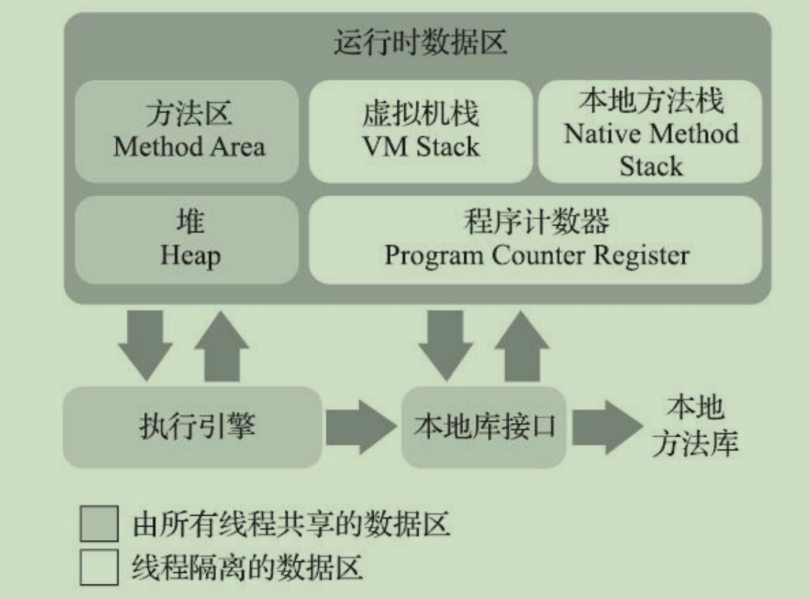
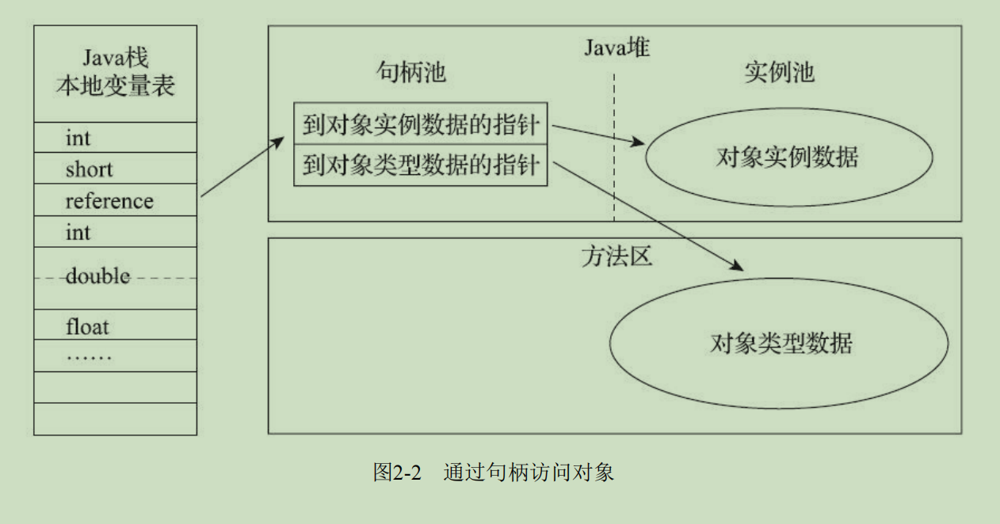
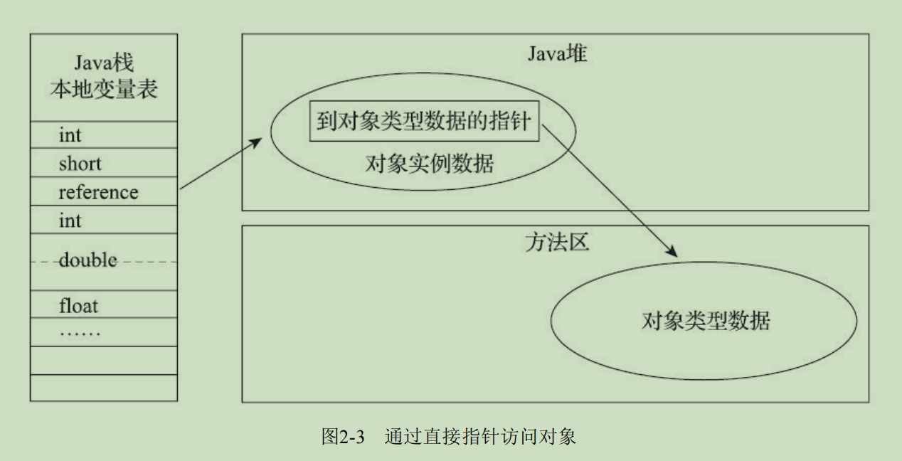

# HotSpot虚拟机
  - 有几十mb的内存消耗
  - 两个即时编译器
    - 编译耗时**短**但输出代码优化程度较**低**的**客户端**编译器（简称为C1）
    - 编译耗时**长**但输出代码优化质量也更**高**的**服务端**编译器（简称为C2）

  - 自JK10起，HotSpot中又加入了一个全新的即时编译器：Graal编译器 是C2的替代品，目前还在试验阶段
  - 提前编译（Ahead of Time Compilation，AOT）
    - 好处
      - Java虚拟机加载这些已经预编译成二进制库就能够直接调用。
        理论上，提前编译可以减少即时编译带来的预热时间。
      - 可以放心地进行很多全程序的分析行为，
        可以使用时间压力更大的优化措施。
    - 坏处
      - 破坏了Java“一次编写，到处运行”的承诺
      - 降低了Java链接过程的动态性
  - Java做并发处理的最小调度单位是线程， 
    Java线程的调度是直接由操作系统内核提供的，
    会有核心态、用户态的切换开销。
  - 更加轻量级的、由软件自身进行调度的用户线程 - Fiber

# 第二部分 自动内存管理
## 第二章 Java内存区域与内存溢出异常

- 程序计数器（Program Counter Register）
  - 线程私有
  - 线程执行Java方法，正在执行的虚拟机字节码指令的地址
  - 线程执行本地（Native）方法，空
- Java虚拟机栈
  - 线程私有
  - 生命周期同线程相同
  - 描述的是Java方法执行的线程内存模型
  - 每个方法被执行的时候，Java虚拟机都 会同步创建一个栈帧（Stack Frame）
    - 栈帧
      - 有局部变量表，操作数栈
      ，动态连接
      ，方法出口等组成
      - 局部变量表
        - 表里存放的数据都是编译期就固定下来的，因此进入方法时，栈帧的局部变量表的大小时固定的。
        - Java虚拟机基本数据类型（boolean、byte、char、short、int、 float、long、double）
        - 对象引用（reference类型，它并不等同于对象本身，
        可能是一个指向对象起始地址的引用指针，也可能是指向一个代表对象的句柄或者其他与此对象相关的位置）
        - returnAddress 类型（指向了一条字节码指令的地址）。
        - 这些数据类型在局部变量表中的存储空间以局部变量槽（Slot）来表示，其中64位长度的long和 double类型的数据会占用两个变量槽，其余的数据类型只占用一个。
        - 局部变量表所需的内存空间在编 译期间完成分配，当进入一个方法时，这个方法需要在栈帧中分配多大的局部变量空间是完全确定 的，在方法运行期间不会改变局部变量表的大小。
     
  - StackOverflowError：线程请求的栈深度大于虚 拟机所允许的深度
  - OutOfMemoryError：Java虚拟机栈容量可以动态扩展(Hotspot不允许，但是线程申请不成功的时候也会出现OOM),当栈扩展时无法申请到足够的内存 
- 本地方法栈
  - Hot-Spot虚拟机直接 就把本地方法栈和虚拟机栈合二为一
  - 《Java虚拟机规范》没有强制要求
  - StackOverflowError和OutOfMemoryError异常，同虚拟机栈
- Java堆
  - 线程共享
  - 是虚拟机所管理的内存中最大的一块
  - 理论上，所有的对象实例以及数组都应当在堆上分配
  - 是垃圾收集器管理的内存区域
  - 线程共享的Java堆中可以划分出多个线程私有的分配缓冲区 （Thread Local Allocation Buffer，TLAB）
  - OutOfMemoryError：Java堆中没有内存完成实例分配，并且堆也无法再 扩展时
- 方法区
  - 线程共享
  - 用于存储已被虚拟机加载 的类型信息、常量、静态变量、即时编译器编译后的代码缓存等数据
  - 《Java虚拟机规范》中把方法区描述为堆的一个逻辑部分
  - HotSpot虚拟机曾用永久代实现方法区
    - 在JDK 6的时候HotSpot开发团队就有放弃永久代，逐步改为采用本地内存（Native Memory）来实现方法区的计划了
    - JDK 7的HotSpot，已经把原本放在永久代的字符串常量池、静态变量等移出
    - JDK 8，完全废弃永久代的概念，改用在**本地内存**中实现的元空间（Meta- space）来代替，
    JDK 7中永久代还剩余的内容（主要是类型信息）全部移到元空间中。
  - 《Java虚拟机规范》对方法区的约束是非常宽松的，甚至可以选择不实现垃圾收集
  - 内存回收目标主要是针对常量池的回收和对类型的卸载，必要但很难。
  - OutOfMemoryError：方法区无法满足新的内存分配需求
  - 运行时常量池（Runtime Constant Pool）
    - 编译期生成的各种字面量与符号引用，这部分内容将在类加载后存放到方法区的运行时常量池中。
    - 由符号引用翻译出来 的直接引用也存储在运行时常量池中。
    - 《Java虚拟机规范》并没有做任何细节的要求
    - String类的 intern()方法，运行期间也可以将新的常量放入池中。
    - OutOfMemoryError：同方法区，常量池无法再申请到内存时
- 直接内存（Direct Memory）
  - 不是虚拟机运行时数据区的一部分
  - 可能导致OutOfMemoryError
  - 在JDK 1.4中新加入了NIO（New Input/Output）类
  引入了一种基于通道（Channel）与缓冲区 （Buffer）的I/O方式
  它可以使用Native函数库直接分配堆外内存
  然后通过一个存储在Java堆里面的 DirectByteBuffer对象作为这块内存的引用进行操作。
  这样能在一些场景中显著提高性能，
  因为避免了在Java堆和Native堆中来回复制数据。
- 对象的创建
  - 检查这个指令的参数是否能在常量池中定位到一个类的符号引用
  - 检查这个符号引用代表的类是否已被加载、解析和初始化过
    - 没有，那 必须先执行相应的类加载过程
  - 虚拟机将为新生对象分配内存。
    - 对象所需内存的大小在类加载完成后便可完全确定
    - 原子性
      - 默认：采用CAS配上失败重试的方式保证更新操作的原子性
      - 把内存分配的动作按照线程划分在不同的空间之中进行，
      即每个线程在Java堆中预先分配一小块内存，
      称为本地线程分配缓冲（Thread Local Allocation Buffer，TLAB），
      哪个线程要分配内存，就在哪个线程的本地缓冲区中分配，
      只有本地缓冲区用完 了，分配新的缓存区时才需要同步锁定。
  - 初始化为零值
    - 使用了TLAB的话，这一项工作也可以提前至TLAB分配时顺便进行
    - 保证了对象的实例字段 在Java代码中可以不赋初始值就直接使用
  - 对象头配置
-  对象的内存布局
  - 对象头（Header）、实例数据（Instance Data）和对齐填充（Padding）
  - 对象头
    - 用于存储对象自身的运行时数据
      - 哈希码（HashCode）、GC分代年龄、锁状态标志、线程持有的锁、偏向线程ID、偏向时间戳等
      - 复用32/64位
    - 类型指针
      - 对象指向它的类型元数据的指针
      - 并不是所有的虚拟机实现都必须在对象数据上保留类型指针。
      换句话说，查找对象的元数据信息并不一定要经过对象本身
    - 如果对象是一个Java数组，那在对象头中还必须有一块用于记录数组长度的数据
  - 实例数据
    - 对象真正存储的有效信息
    - 默认的分配顺序 相同宽度的字段总是被分配到一起存放 + 父类定义在子类对象前
  - 对齐填充
    - 8字节对齐，填充实例数据
- 对象的访问定位
  - Java程序会通过栈上的reference数据来操作堆上的具体对象
  - 对象访问方式也是由虚拟机实现而定的
  - 主流的访问方式主要有使用句柄和直接指针两种
  - 句柄访问
  
    - reference中存储的是对象的句柄地址
    - 句柄中包含了对象实例数据与类型数据各自的地址信息
    - 对象移动是（GC中）不需要修改reference
  - 直接指针访问
  
    - Java堆中对象的内存布局就必须考虑如何放置访问类型数据的相关 信息
    - 如果只是访问对象本身的话，不需要多一次间接访问的开销
    - HotSpot常用（有例外情况，如果使用了Shenandoah收集器的 话也会有一次额外的转发）
- String::intern()
  - 本地方法
  - 如果字符串常量池中已经包含一个等于此String对象的字符串，则返回代表池中这个字符串的String对象的引用
    否则，会将此String对象包含的字符串添加到常量池中，并且返回此String对象的引用。
  - JDK 6中，intern()方法会把首次遇到的字符串实例复制到永久代的字符串常量池 中存储，返回的也是永久代里面这个字符串实例的引用，
  - JDK 7（以及部分其他虚拟机，例如JRockit）的intern()方法实现就不需要再拷贝字符串的实例到永久代了，既然字符串常量池已经移到Java堆中，那只需要在常量池里记录一下首次出现的实例引用即可，
  因此intern()返回的引用和由StringBuilder创建的那个字符串实例就是同一个。